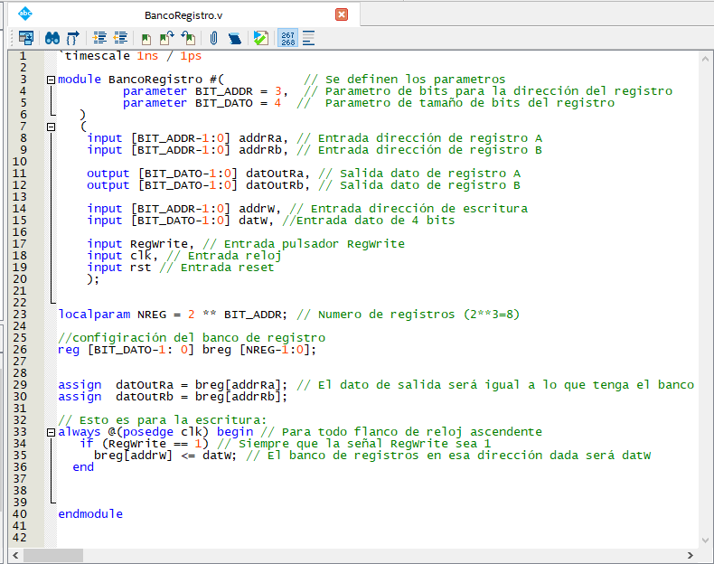
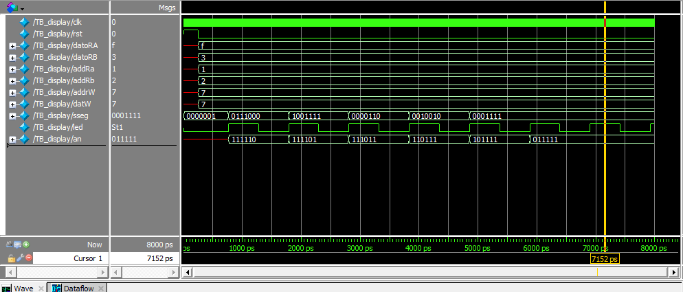

# LABORATORIO 04 - Diseño de banco de registro.

* Nicolás Velásquez Ospina
* Jhair Steven Gallego Mendez
* Juan David Sarmiento Lastra

### Introducción
Para empezar, se puede definir a un registro como una memoria de almacenamiento temporal, o a su vez, como circuitos secuenciales constituidos por flip-flops. A su vez un banco de registros se compone por un numero n de registros, los cuales pueden ser seleccionados por una señal de control, que define la función a realizar, es decir lectura o escritura. El banco de registros puede tener varios puertos de salida y varios de entrada, permitiendo de esta forma la lectura o la escritura simultánea de varios registros.

## Banco de registro
Para la implementación necesaria para el banco de registro se deben tener en cuenta las siguientes condiciones a la hora de elaborar el diseño:
* Debe contar con 8 registros de 4 bits.
* Lectura de 2 registros simultáneos.
* Señal que controla la escritura de un registro (RegWrite).
* Contar con señal reset.
* Visualización de la información en displays
* Ingreso de información por medio de interruptores

Teniendo en cuenta lo anterior, los bloques a realizar resultan de la siguiente manera:


Con esto nos damos cuentas de las entradas y salidas de nuestro bloque de banco de registro. Las entradas están comprendidas por:
* datW [3:0] = Nos indica que el registro es de 4 bits
* addrW [2:0] = Es la dirección de escritura, es de 3 bits porque son 8 registros
* addrA [2:0] = Dirección para el dato de salida A
* addrB [2:0] = Dirección para el dato de salida B
* RegWrite = Señal de control para la escritura
* clk = Reloj
* rst= Reset

Y las salidas:
* datA [3:0] = Dato de salida A
* datB [3:0] = Dato de salida A

En el repositorio proporcionado por el profesor nos encontramos con el archivo de Quartus BancoRegistro.v :



En este módulo proporcionado nos encontramos con la descripción en verilog del banco de registro. Como primer paso se definen los parámetros `BIT_ADDR` y `BIT_DATO`, donde el primero refiere al tamaño de bits necesario para la dirección del registro, que en este caso son 3 bits, ya que son 8 registros. El segundo se re refiera al tamaño en bits de cada registro, que ya se habían mencionado que eran 4 bits. Posteriormente gracias a esto se definen las entradas y las salidas del bloque de banco de registro que ya se habían trabajado.

El siguiente paso será adecuado a la configuración del banco de registros como tal, donde se define el tamaño del mismo, es decir, el número de registros que tendrá el banco, comprendido por NREG = 2 ** BIT_ADDR.
Así mismo se asignan los datos de salida que tendrá el banco de registro según la dirección proporcionada con anterioridad.

Para la escritura se sabe que siempre que la señal RegWrite sea 1, el registro de la dirección addrW será datW.

Orientandonos con el diagrama de bloques, se observa que la salida de esté banco de registros vendrá conectada a la visualizacion dinamica realizada en el pasado laboratorio, es por esto que se tendrá que instanciar el archivo display.v, al igual que en el interior de este vendrá instanciado BCDtoSseg.v:

___
> ## Modificación banco de displays

El módulo para manejar displays de manera dinámica tuvo que ser modificado con el fin de utilizar ahora 6 en vez de cuatro. El código se presenta a continuación.

```verilog 
`timescale 1ns / 1ps

module display (
	input [3:0] datoRA,   // 4 bits salida registro A (1 display)
	input [3:0] datoRB,   // 4 bits salida registro B (1 display)
	input [2:0] addRa, 	 // 4 bits dirección registro A (1 display)
	input [2:0] addRb,    // 4 bits dirección registro B (1 display)
	input [2:0] addrW,    // Dirección de escritura
	input [3:0] datW,     // Dato a escribir
   	input clk,
	input rst,
   	output [0:6] sseg,    // Salida 7 segmentos
   	output reg [5:0] an,  // Habilita 6 display
	output led 			 	 // LED indicador de frecuencia	
    );

	reg [3:0] bcd = 0;

	BCDtoSSeg bcdtosseg(.BCD(bcd), .SSeg(sseg));

	reg [26:0] cfreq = 0;
	wire enable;

	// Divisor de frecuecia

	assign enable = cfreq[8];
	assign led = enable;
	always @(posedge clk) begin
	if(rst == 1) begin
			cfreq <= 0;
		end else begin
			cfreq <= cfreq + 1;
		end
	end

	reg [2:0] count = 0;
	always @(posedge enable) begin
			if(rst == 1) begin // cambiar a 1 para simulación en ModelSim
				count <= 0;
				an <= 6'b111111; 
			end else begin 
				if (count == 6) begin
				 	count <= 0;
				end
				case (count) 
					3'b000: begin bcd <= datoRA;   an <= 6'b111110; end 
					3'b001: begin bcd <= addRa;    an <= 6'b111101; end 
					3'b010: begin bcd <= datoRB;   an <= 6'b111011; end 
					3'b011: begin bcd <= addRb;    an <= 6'b110111; end 
					3'b100: begin bcd <= datW;     an <= 6'b101111; end 
					3'b101: begin bcd <= addrW;    an <= 6'b011111; end 
				endcase
				count <= count + 1;				
			end
	end

endmodule
```

Se decidió utilizar 6 display puesto que de este modo resulta más fácil la visualización de los valores sobre los registros, así como las direcciones de escritura y lectura. De este modo, se dedican tres display para observar los valores sobre los registros _*A*_ y _*B*_ (_dataRA_, _dataRB_) y el valor a escribir _datW_, cuando se requiere sobreescribir un registro. Los restantes tres display se utilizan para visualizar las direcciones de lectura y escritura de _datoRA_ _datoRB_ y _datW_, respectivamente, representados en el código por las referencias _addRa_, _addRb_ y _addrW_, respectivamente.

### Divisor de frecuencia
Con el fin de visualizar con mayor facilidad los resultados en el _Modelsim Altera_, se decició reducir la frecuencia de cambio del banco de LEDs, , reduciendola a una señal con periodo de $1022 ns$. Este periodo se obtuve al cambiar el bit de acceso sobre el regisstro _cfreq_, para este caso accediendo el 9 bit. 

Una vez definida la frecuencia de trabajo, se implementa la lógica de cambio de display, para esto, resulta necesario incrementar el tamaño del registro _count_ a 3 bits. Asimismo, puesto que el 5to display se activa con la combinación ```101```, se debe implementar un condicional que permitar restablecer a cero el valor de _count_ con el fin de conserva el patrón. Anteriormente como se trabajaba con cuatro display, la combinación más grande resultaba ser ```11```, por lo que al tomar solo los dos bits menos significativos, el registro _count_ podía incrementarse indefinidamente y el patrón seguiria adecuandose a lo necesitado.


> ## Unidad de testeo del banco de displays

El código para la _testbench_ del banco de display resulta bastante sencillo y se muestra a continuación.

```verilog
`timescale 1ps/1ps

module TB_display;
	
	reg [3:0] datoRA;   // 4 bits salida registro A (1 display)
	reg [3:0] datoRB;   // 4 bits salida registro B (1 display)
	reg [2:0] addRa; 	// 4 bits dirección registro A (1 display)
	reg [2:0] addRb;    // 4 bits dirección registro B (1 display)
	reg [2:0] addrW;    // Dirección de escritura
	reg [3:0] datW;     // Dato a escribir
    reg clk;
	reg rst;

    wire [0:6] sseg;   	// Salida 7 segmentos
    wire [5:0] an; 	 	// Habilita 6 display
	wire led; 			// LED indicador de frecuencia	

   display dsps( datoRA, datoRB, addRa, addRb, addrW,
                     datW, clk, rst, sseg, an, led );
    
    initial begin
        clk = 0;
		rst = 1;
		#250 rst = 0;
		
		addRa = 1; datoRA = 15;
		addRb = 2; datoRB = 3;
		addrW = 7; datW = 7;

    end
	 always #1 clk = ~clk;
endmodule

```

Posterior a la instanciación del módulo _display_, se asignan valores estáticas para ser mostrados en cada uno de los 6 display. Previo a esto, se inicializa el registro _*rst*_ en 0, estado en el cual se mantiene durante $256 ps$, lo cual corresponde a un cuarto de la frecuencia de cambio sobre los display. Esto se realiza con el fin de observar con mayor facilidad el efector del _*rst = 0*_ sobre las variables del sistema. El resultado de la simulación se presenta a continuación.



En la imagen anterior se puede observar claramente el efecto del _*rst=0*_ sobre los primeros picosegundos de simulación. Allí se observa cómo los valores a mostra en cada uno de los display resultan indefinidos (línea roja), y los LED de salida para los display se inicializan al valor por defecto $0$, conforme al código ```text reg [3:0] bcd = 0``` presentado anteriormente en la definción del banco de display. Luego de esto, se asignan los valores a mostrar en cada display y se inicia la visualización dinámica. Lo cual puede ser comprobado al verificar los valores que toma el registro _*sseg*_, conforme a los asignados y según el display que se encuentre activo en ese momento, indicado por el registro _*an*_.

___

> ## Integración de todos los módulos

### Resultados de simulación unidad de testeo
