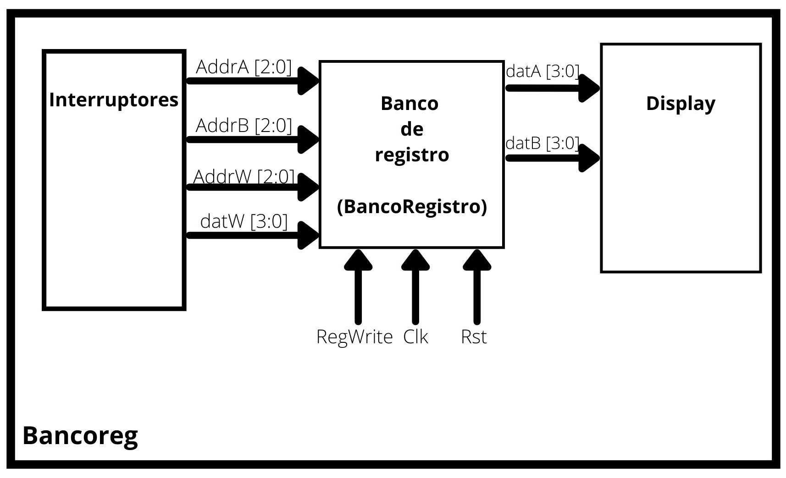

# LABORATORIO 04- Diseño de banco de registro.

* Nicolás Velásquez
* Steven Gallego
* J. David S. Lastra.

### Introducción
Para empezar, se puede definir a un registro como una memoria de almacenamiento temporal, o a su vez, como circuitos secuenciales constituidos por flip-flops. A su vez un banco de registros se compone por un numero n de registros, los cuales pueden ser seleccionados por una señal de control, que define la función a realizar, es decir lectura o escritura. El banco de registros puede tener varios puertos de salida y varios de entrada, permitiendo de esta forma la lectura o la escritura simultánea de varios registros.

## Banco de registro
Para la implementación necesaria para el banco de registro se deben tener en cuenta las siguientes condiciones a la hora de elaborar el diseño:
* Debe contar con 8 registros de 4 bits.
* Lectura de 2 registros simultaneos.
* Señal que controla la escritura de un registro (RegWrite).
* Contar con señal reset.
* Visualizacion de la informacion en displays
* Ingreso de informacion por medio de interruptores

Teniendo en cuenta lo anterior, los bloques a realizar resultan de la siguiente manera:

